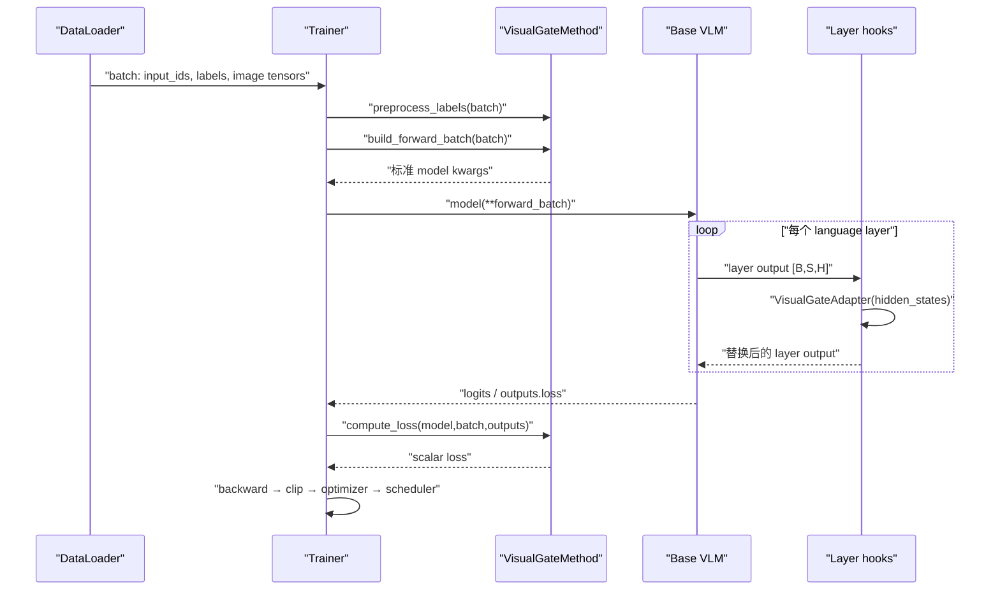
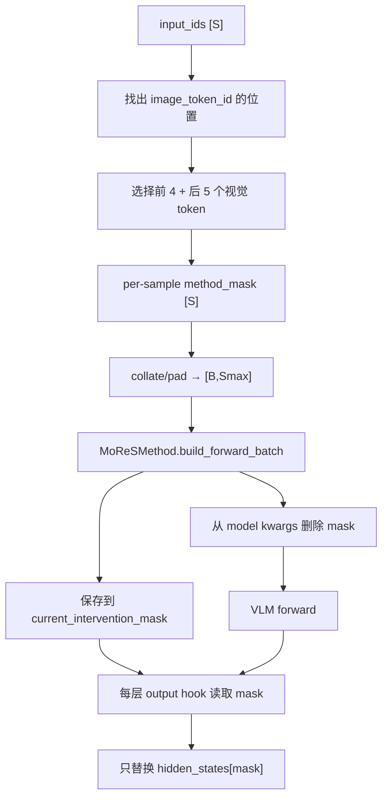
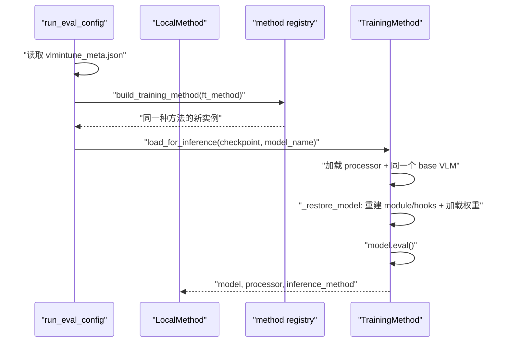

# 在 vlmintune 中实现一个训练方法：从数据集到训练、推理与 Evaluation

本文面向要给 `vlmintune` 增加新训练方法的开发者。目标不是只让代码“能够被 registry 找到”，而是让一个方法完整走通下面这条链路：

```mermaid
flowchart LR
    A["Hugging Face 原始 row"] --> B["DatasetSpec.parse_row"]
    B --> C["CanonicalSample"]
    C --> D["ChatTemplatePreprocessor.tokenize"]
    D --> E["collate: batch tensors"]
    E --> F["TrainingMethod.build_forward_batch"]
    F --> G["VLM forward + 自定义 Module / hook"]
    G --> H["TrainingMethod.compute_loss"]
    H --> I["optimizer 只更新方法参数"]
    I --> J["方法权重 + vlmintune_meta.json"]
    J --> K["LocalMethod.from_checkpoint"]
    K --> L["重新安装 Module / hook 并恢复权重"]
    L --> M["prompt-only generate"]
    M --> N["metric + predictions.jsonl + eval.json"]
```



全文使用两条互相补充的主线：

1. 先用内置 TextVQA 跑通一次训练和评测，理解整个系统的输入与产物。
2. 再实现一个真正包含自定义 `nn.Module` 和 forward hook 的方法 `visual_gate`，说明方法作者需要写什么、数据在哪一层进入、训练和推理如何共用同一实现。

最后单独说明 MoReS/ReFT 这类“只干预特定 token、训练和生成阶段 mask 来源不同”的方法需要额外接通哪些位置。

> 本文对应当前 initial-release 接口。公共训练 YAML 是严格的 11 个字段；方法结构、rank、hook 位置和方法专用参数都固定写在方法代码中。

## 1. 先建立正确的心智模型

在 `vlmintune` 里，一个训练方法不是一种 loss，也不是一个数据集，更不是一个必须继续细分的继承体系。

一个方法通常由四件事组成：

- **模型改造**：冻结哪些参数，创建哪些自定义 `nn.Module`，把 hook 安装在哪些层。
- **运行时数据流**：模型 forward 前是否还需要 token mask、position、路由信息等额外状态。
- **训练规则**：用什么 loss，optimizer 应拿到哪些参数。
- **持久化规则**：保存哪些权重，推理时如何重新建立相同结构并加载权重。

其中“参数高效训练”和“loss”是两个正交维度。例如 LoRA 是模型改造方式，它当前仍然使用 causal language-model cross entropy；另一个 PEFT 方法完全可以使用不同 loss。同样，一个全量微调方法也可以使用相同的 cross entropy。

`TrainingMethod` 只要求每个方法明确回答这些问题，并不要求把方法归入“CE 类”或“PEFT 类”。

### 1.1 哪些文件负责什么

| 责任 | 当前代码位置 |
| --- | --- |
| 公共训练配置 | `src/vlmintune/config/training_config.py` |
| 训练 CLI | `src/vlmintune/training/__main__.py` |
| 训练主循环 | `src/vlmintune/training/trainer/trainer.py` |
| 方法接口 | `src/vlmintune/training/methods/base.py` |
| 方法注册表 | `src/vlmintune/training/methods/registry.py` |
| 数据集加载 | `src/vlmintune/data/hf_datasets.py` |
| 数据集 schema | `src/vlmintune/data/datasets/` |
| 统一样本类型 | `src/vlmintune/data/types.py` |
| chat template、labels 和 batch collate | `src/vlmintune/training/chat_template.py` |
| checkpoint 推理加载 | `src/vlmintune/eval/method.py` |
| evaluation 主流程 | `src/vlmintune/eval/run.py` |
| VQA 指标 | `src/vlmintune/eval/vqa.py` |

## 2. 不写新方法，先跑通一次端到端流程

### 2.1 安装

```bash
pip install -e .
```

如果要运行 QLoRA，还需要 fine-tuning extra：

```bash
pip install -e ".[finetune]"
```

训练建议使用 CUDA GPU。模型和数据来自 Hugging Face；如果资源需要 token，可以在 CLI 中传 `--hf-token` 或 `--hf-token-file`。

### 2.2 写训练配置

创建 `train_config.yaml`：

```yaml
model: qwen25vl_3b_instruct
dataset: lmms-lab/textvqa
method: mores
epochs: 1
learning_rate: 0.0002
batch_size: 1
gradient_accumulation_steps: 4
max_length: 2048
max_samples: 8
seed: 42
output_dir: experiments/textvqa_mores_demo/checkpoint
```

这 11 个字段就是当前公共训练接口的全部字段。几个容易误解的地方：

- `max_samples: 0` 表示使用完整训练 split；正数用于 smoke test 或子集实验。
- 训练 YAML 目前不能写 `split`、`streaming`、`column_map` 或 `method_params`。
- 因此训练 split 来自数据集 spec 的 `default_train_split`。
- `output_dir` 直接就是最终 checkpoint 目录。把它放在 `experiments/<实验名>/checkpoint` 下，最方便后续 evaluation。

先用 8 个样本验证完整链路，不要一开始就提交完整数据集训练。

### 2.3 启动训练

```bash
python -m vlmintune.training --config train_config.yaml
```

也可以使用仓库中的 runner；它会生成同样的严格配置：

```bash
MODEL=qwen25vl_3b_instruct \
DATASET=lmms-lab/textvqa \
METHOD=mores \
MAX_SAMPLES=8 \
RUN_NAME=textvqa_mores_demo \
bash experiment_setup/paper_benchmark/run_paper_benchmark.sh
```

训练结束后，MoReS 目录至少包含：

```text
experiments/textvqa_mores_demo/checkpoint/
├── mores_tuned.pt
├── vlmintune_meta.json
└── train_config.yaml       # 使用 runner 时生成
```

`vlmintune_meta.json` 中最关键的是：

```json
{
  "model_name": "qwen25vl_3b_instruct",
  "hf_model_id": "Qwen/Qwen2.5-VL-3B-Instruct",
  "ft_method": "mores",
  "recipe": "mores"
}
```

Evaluation 依靠 `model_name` 找回 base model，依靠 `ft_method` 找回方法类，再由方法类解释自己的权重文件。

### 2.4 写 evaluation 配置

创建 `eval_config.yaml`：

```yaml
model:
  name: qwen25vl_3b_instruct

experiment:
  name: textvqa_mores_demo
  base_dir: experiments

eval:
  source: trained
  checkpoint_path: experiments/textvqa_mores_demo/checkpoint
  dataset_name: lmms-lab/textvqa
  split: validation
  max_samples: 8
  streaming: true
  sample_seed: 42
  shuffle_buffer_size: 10000
  max_new_tokens: 32
  temperature: 0.0
```

然后运行：

```bash
python -m vlmintune.eval --config eval_config.yaml
```

当前 evaluation 只接受已经注册的数据集。`split` 可以省略，省略后取数据集 spec 的 `default_eval_split`。

当前 `LocalMethod.generate()` 固定使用 `do_sample=False`，而且没有把 `temperature` 传给 `model.generate()`；所以配置中的 `temperature` 目前不会改变生成结果。需要采样时，应先修改并测试 generation 实现，不能只改 YAML。

评测产物位于：

```text
experiments/textvqa_mores_demo/eval_trained/
├── eval.json
├── predictions.jsonl
├── eval_ids.json
└── run.log
```

同一个 experiment、同一种 `source` 再次评测时，这些文件会以写模式覆盖；需要保留不同配置的结果时，应使用不同 experiment 名称或先归档旧目录。

`predictions.jsonl` 的每一行包含：

```json
{
  "id": "123",
  "question": "What word is printed on the sign?",
  "prediction": "stop",
  "ground_truth": ["stop", "stop", "STOP", "halt", "stop"],
  "scores": {"vqa_accuracy": 1.0}
}
```

## 3. 数据集是怎样进入训练的

### 3.1 统一数据契约：`CanonicalSample`

不管 Hugging Face 上的原始列名是什么，训练前都会被转换成：

```python
@dataclass
class CanonicalSample:
    id: str
    image_path: str
    question: str
    train_answer: str = ""
    eval_answers: list[str] = ...
    metadata: dict[str, Any] = ...
```

这里有意区分：

- `train_answer`：训练时使用的一个答案。
- `eval_answers`：评测时保留的完整标注答案列表。

以 TextVQA 的一行数据为例：

```python
row = {
    "question_id": 123,
    "image": image_object,  # PIL.Image 或 Hugging Face Image 字段值
    "question": "What word is printed on the sign?",
    "answers": [
        {"answer": "stop"},
        {"answer": "stop"},
        {"answer": "STOP"},
        {"answer": "halt"},
        {"answer": "stop"},
    ],
}
```

`TextVQASpec.parse_row()` 会得到类似：

```python
CanonicalSample(
    id="123",
    image_path="<in_memory>",
    question="What word is printed on the sign?",
    train_answer="stop",
    eval_answers=["stop", "stop", "STOP", "halt", "stop"],
    metadata={"_pil_image": ...},
)
```

训练答案使用原始字符串的多数票；evaluation 不丢弃其他 annotator 的答案，因为 VQA accuracy 需要完整答案集合。

### 3.2 内置数据集

| 配置中的 `dataset` | HF 数据集 | 默认训练 split | 默认评测 split | 指标 |
| --- | --- | --- | --- | --- |
| `lmms-lab/textvqa` | `lmms-lab/textvqa` | `train` | `validation` | `vqa_accuracy` |
| `pingzhili/vqa_v2` | `pingzhili/vqa_v2` | `train` | `validation` | `vqa_accuracy` |
| `ebrukilic/vizwiz_vqa_dataset` | 同名 | `train` | `validation` | `vqa_accuracy` |
| `Mineru/GQA` | `Mineru/GQA` | `train_balanced` | `val_balanced` | `normalized_exact_match` |
| `scienceqa_image` | `derek-thomas/ScienceQA` 的有图样本 | `train` | `validation` | `normalized_exact_match` |

ScienceQA 会把问题和选项渲染成：

```text
Question: <question>
Options:
0. <choice 0>
1. <choice 1>
Answer with only the option index.
```

### 3.3 `HFDatasetsAdapter` 做了什么

训练入口最终会调用：

```python
HFDatasetsAdapter(
    dataset_name=config.data_config["dataset_name"],
    usage="train",
    max_samples=max_samples or None,
    sample_seed=seed,
)
```

它的职责是：

1. 找到对应 `HFDatasetSpec`。
2. 根据 `usage="train"` 或 `usage="eval"` 选择默认 split。
3. 调用 `datasets.load_dataset()`。
4. 按 seed 打乱或流式 shuffle。
5. 把每一行交给 spec 的 `parse_row()`。
6. 产出 `CanonicalSample`。

当训练配置使用正数 `max_samples` 时，当前 adapter 会转为 streaming，避免为了取少量样本先下载完整数据集。完整训练则通常使用普通 map-style dataset，具体还受 dataset spec 的 `prefer_streaming` 影响。

训练器需要能够确定计划样本数；对无法从 builder metadata 得到长度的流式数据，应该显式给出 `max_samples`。

### 3.4 图像如何传递

HF image 字段可能是 PIL、文件路径或 `{"bytes": ..., "path": ...}`。数据层把它规范化到：

- `sample.image_path`；或
- `sample.metadata["_pil_image"]`；或
- `sample.metadata["_image_bytes"]`。

tokenization 和 evaluation 都通过同一个 `load_sample_image(sample)` 取图，并统一转换成 RGB。这样训练与推理不会各写一套不同的图像解析逻辑。

### 3.5 增加一个新数据集

如果只在 Python 中手动使用 adapter，可以传 `ColumnMapping`：

```python
from vlmintune.data.datasets.base import ColumnMapping
from vlmintune.data.hf_datasets import HFDatasetsAdapter

adapter = HFDatasetsAdapter(
    dataset_name="my-org/my-vqa",
    split="train",
    column_map=ColumnMapping(
        id_col="sample_id",
        image_col="jpg",
        question_col="prompt",
        answer_col="labels",
    ),
)
```

但这条 Python API 不能直接通过当前 11 字段训练 YAML 表达，evaluation 也只接受 registry 中的数据集。要完整走通公共训练 CLI 和 evaluation，应增加一个明确的数据集 spec：

```python
# src/vlmintune/data/datasets/my_vqa.py
from vlmintune.data.datasets.base import (
    ColumnMapping,
    DatasetDataModel,
    HFDatasetSpec,
)


class MyVQASpec(HFDatasetSpec):
    dataset_name = "my-org/my-vqa"
    data_model = DatasetDataModel(
        dataset_name=dataset_name,
        default_train_split="train",
        default_eval_split="validation",
        metric_family="vqa_accuracy",
    )
    mapping = ColumnMapping(
        id_col="sample_id",
        image_col="jpg",
        question_col="prompt",
        answer_col="labels",
    )

```

然后在 `src/vlmintune/data/datasets/registry.py` 中 import 它，并把 `MyVQASpec` 加入 `_SPEC_CLASSES`。

如果你的答案不是普通字符串、字符串列表或 `{"answer": ...}` 列表，就覆盖 `parse_answers()`；如果问题需要拼接选项或系统指令，就覆盖 `parse_question()`。不要在训练器中对特定数据集写 `if dataset_name == ...`。

至少测试以下内容：

- 原始 row 能否得到正确 `id/question/train_answer/eval_answers`。
- 默认 train/eval split 是否正确。
- 有图和无图样本是否符合预期。
- evaluation 使用的 metric family 是否正确。
- 如果使用 L2T，确认 `question` 正好是希望整体监督的 user prompt 文本。

## 4. 从 `CanonicalSample` 到模型 batch

### 4.1 同一个样本会构造两份文本

`ChatTemplatePreprocessor.tokenize()` 对训练样本分别构造：

1. **full input**：question + assistant answer。
2. **prompt-only input**：只有 question，并保留 generation prompt。

设一个样本 tokenization 后的概念序列为：

```text
位置:       0       1..9          10..15          16      17
token:    <bos>  <image tokens>  question/prompt  stop   <eos>
full:       ✓         ✓               ✓             ✓      ✓
prompt:     ✓         ✓               ✓
labels:   -100      -100            -100          stop   <eos>
```

真正 token id 和边界由模型 processor 决定，上表只是解释数据流。实现中先复制 `input_ids` 得到 `labels`，再把 prompt 长度以内的位置设为 `-100`。因此普通方法默认只在 assistant answer 上计算 causal LM loss。

### 4.2 collate 后的 batch

样本先各自 tokenization，随后右侧 padding。标准 batch 至少包含：

```python
{
    "input_ids":      LongTensor[B, S_max],
    "labels":         LongTensor[B, S_max],   # prompt/pad 为 -100
    "attention_mask": LongTensor[B, S_max],
    "pixel_values":   ...,                    # 有图时
    "image_grid_thw": ...,                    # 取决于模型
    "image_sizes":    ...,                    # 取决于模型
    "mm_token_type_ids": ...,                 # 取决于模型
}
```

如果方法需要额外 token mask，应该在 tokenization 中生成一维 `[S]` mask，在 collate 中 padding 成 `[B, S_max]`。不要把未 padding 的 Python list 直接传进 layer hook。

### 4.3 坏样本如何处理

tokenization 中的异常会被记录，该样本返回 `None`；`safe_collate()` 会丢弃 `None`。如果一个 batch 全部无效，它会返回空字典，训练循环跳过该 batch。

训练循环还会跳过所有 labels 都是 `-100` 的 batch。如果最终没有任何 optimizer step，训练会报错，而不是生成一个看似成功但没有更新权重的 checkpoint。

## 5. `TrainingMethod` 到底要求实现什么

一个可实例化的方法至少实现：

```python
class TrainingMethod(ABC):
    def prepare_model_impl(self, model, processor, model_spec): ...
    def compute_loss(self, model, batch, outputs): ...
    def get_trainable_params(self, model): ...
    def _save_weights(self, model, path): ...
    def _restore_model(self, model, processor, model_spec, path): ...
```

它们的含义是：

| 方法 | 必须回答的问题 |
| --- | --- |
| `prepare_model_impl` | 自定义 module 在哪里创建？hook 装在哪里？哪些参数被冻结或训练？ |
| `compute_loss` | 当前方法怎样从 `outputs` 和 `batch` 得到 scalar loss？ |
| `get_trainable_params` | optimizer 精确更新哪些参数？是否有多个 lr group？ |
| `_save_weights` | checkpoint 中保存哪一组方法权重？ |
| `_restore_model` | 如何在一个新加载的 base model 上重建结构、hook 并加载权重？ |

按需要覆盖的可选接口：

| 接口 | 什么时候需要 |
| --- | --- |
| `requires_quantization()` | base model 必须 4-bit 加载时 |
| `preprocess_labels()` | 要改变监督 token，例如 L2T 时 |
| `build_forward_batch()` | batch 含模型不接受的 runtime metadata，或 hook 需要先保存状态时 |
| `prepare_inference_inputs()` | generation 需要 `use_cache` 或其他方法专用输入时 |
| `_checkpoint_metadata()` | 要记录 recipe/version/结构信息时 |

## 6. 完整示例：自定义 Module + hook 的 `visual_gate`

下面的方法不是为了复现某篇论文，而是提供一个最小但完整的 hook 方法模板：

- 冻结整个 VLM backbone。
- 每个语言 Transformer layer 有一个独立的 bottleneck adapter。
- adapter 在 layer output 上做 residual 更新。
- 标准 answer-only causal LM loss。
- 只保存 adapter 权重。
- 推理加载时重新创建 adapter、重新安装 hook、再恢复权重。

### 6.1 先写自定义 `nn.Module`

创建 `src/vlmintune/training/methods/visual_gate.py`：

```python
from __future__ import annotations

import os
from typing import Any

import torch
import torch.nn as nn

from vlmintune.training.methods.base import TrainingMethod
from vlmintune.training.trainer.ce_loss import CrossEntropyLoss


VISUAL_GATE_RANK = 8
VISUAL_GATE_FORMAT = "visual_gate_rank8_v1"
CE_LOSS = CrossEntropyLoss()


def first_parameter_device(module: nn.Module) -> torch.device:
    return next(module.parameters()).device


class VisualGateAdapter(nn.Module):
    """A small residual bottleneck applied to a layer output."""

    def __init__(self, hidden_size: int, rank: int = VISUAL_GATE_RANK) -> None:
        super().__init__()
        self.down = nn.Linear(hidden_size, rank, bias=False, dtype=torch.float32)
        self.up = nn.Linear(rank, hidden_size, bias=False, dtype=torch.float32)
        self.activation = nn.GELU()

        # Zero-init keeps the initial model function unchanged while allowing
        # `up` to receive gradients on the first step.
        nn.init.normal_(self.down.weight, mean=0.0, std=0.02)
        nn.init.zeros_(self.up.weight)

    def forward(self, hidden_states: torch.Tensor) -> torch.Tensor:
        original_dtype = hidden_states.dtype
        hidden_fp32 = hidden_states.to(torch.float32)
        update = self.up(self.activation(self.down(hidden_fp32)))
        return (hidden_fp32 + update).to(original_dtype)
```

这里有三个重要细节：

1. `VisualGateAdapter` 必须继承 `nn.Module`，参数才能被 PyTorch 注册、被 optimizer 找到、被 checkpoint 保存。
2. base VLM 通常是 BF16，而小 adapter 可以在 FP32 中计算；返回前再转回输入 dtype。
3. `up` 零初始化使初始 forward 等价于原模型。第一步 `up` 有梯度，而 `down` 通常要等 `up` 离开零后才获得有效梯度，这是预期行为。

### 6.2 写 output hook

继续在同一文件中写方法类：

```python
class VisualGateMethod(TrainingMethod):
    name = "visual_gate"
    display_name = "Visual Gate"
    supported_model_names = (
        "qwen25vl_3b_instruct",
        "llava15_7b",
    )

    def layer_hook(self, adapter: VisualGateAdapter):
        def hook(module, args, output):
            del module, args

            if isinstance(output, tuple):
                hidden_states = output[0]
                updated = adapter(hidden_states)
                return (updated, *output[1:])

            return adapter(output)

        return hook
```

Transformer layer 常见输出是 tuple，第一项为 `[B, S, H]` hidden states，后面可能还有 cache 或 attention。hook 只能替换需要修改的第一项，其他项必须原样返回。

不要对 `output` 原地写入。使用新 tensor，或者像 MoReS 一样先 `clone()` 再替换选中位置，可以避免 autograd 和共享 view 问题。

### 6.3 冻结 backbone、创建 adapter、安装 hook

下面 6.3–6.5 的方法都继续写在同一个 `VisualGateMethod` 类中。

```python
    def prepare_model_impl(self, model, processor, model_spec):
        del processor

        if hasattr(model, "visual_gate_adapters"):
            raise RuntimeError("VisualGateMethod was already installed on this model.")

        for parameter in model.parameters():
            parameter.requires_grad = False

        hidden_size = int(model_spec.get_hidden_size(model))
        layers = list(model_spec.get_transformer_layers(model))

        adapters = []
        for layer in layers:
            adapter = VisualGateAdapter(hidden_size)
            adapter = adapter.to(first_parameter_device(layer))
            adapters.append(adapter)
            layer.register_forward_hook(self.layer_hook(adapter))

        # ModuleList 很关键：它把所有 adapter 注册为 model 的子模块。
        model.visual_gate_adapters = nn.ModuleList(adapters)

        trainable = sum(p.numel() for p in model.parameters() if p.requires_grad)
        total = sum(p.numel() for p in model.parameters())
        info = (
            f"Visual Gate: backbone={model_spec.name}, rank={VISUAL_GATE_RANK}, "
            f"layers=all ({len(layers)})\n"
            f"Trainable: {trainable:,} / {total:,} "
            f"({100 * trainable / max(1, total):.4f}%)"
        )
        return model, info
```

`model_spec` 隔离了 Qwen 与 LLaVA 的结构路径。方法不要硬编码 `model.model.language_model.layers` 或某个 hidden size；应调用：

```python
model_spec.get_transformer_layers(model)
model_spec.get_hidden_size(model)
```

这也是判断一个方法是否真正支持多个模型的边界：不仅配置中允许模型名，实际 layer 路径、shape、hook output 和 checkpoint round-trip 都必须测试通过。

### 6.4 明确 loss 和 optimizer 参数

```python
    def compute_loss(self, model, batch, outputs):
        return CE_LOSS.compute(model, batch, outputs)

    def get_trainable_params(self, model):
        params = [
            parameter
            for parameter in model.visual_gate_adapters.parameters()
            if parameter.requires_grad
        ]
        if not params:
            raise RuntimeError("Visual Gate has no trainable parameters.")
        return [{"params": params}]
```

这里选择 CE 是这个方法的训练定义，不是因为它属于某个 `PeftTrainingMethod`。如果论文定义了额外的 KL、contrastive、routing 或 regularization loss，就在 `compute_loss()` 中明确计算并返回：

```python
return total_loss, {
    "ce_loss": float(ce_loss.detach()),
    "regularization_loss": float(reg_loss.detach()),
}
```

不要把额外 loss 隐藏在 hook 的副作用里；hook 负责改 forward 表示，`compute_loss()` 负责说明优化目标。

### 6.5 保存与恢复

对于这个没有特殊 PyTorch parametrization 的 adapter，普通 `state_dict()` 足够：

```python
    def _save_weights(self, model, path):
        state = {
            key: value.detach().cpu()
            for key, value in model.visual_gate_adapters.state_dict().items()
        }
        torch.save(
            {"format": VISUAL_GATE_FORMAT, "state_dict": state},
            os.path.join(path, "visual_gate_tuned.pt"),
        )

    def _restore_model(self, model, processor, model_spec, path):
        # 此处拿到的是新加载的 base model；先重建 module 和 hook。
        model, _ = self.prepare_model(
            model,
            processor,
            model_spec=model_spec,
        )
        payload = torch.load(
            os.path.join(path, "visual_gate_tuned.pt"),
            map_location="cpu",
            weights_only=True,
        )
        if payload.get("format") != VISUAL_GATE_FORMAT:
            raise ValueError("Checkpoint is not Visual Gate rank-8 v1 format.")
        state = payload.get("state_dict")
        if not isinstance(state, dict):
            raise ValueError("Visual Gate checkpoint is missing state_dict.")
        model.visual_gate_adapters.load_state_dict(state, strict=True)
        return model

    def _checkpoint_metadata(self):
        return {"recipe": VISUAL_GATE_FORMAT}
```

完整逻辑顺序不能反过来：

```text
加载同一个 base VLM
    → 创建同样数量和 shape 的 adapter
    → 安装同样位置的 hook
    → 加载 adapter state
    → model.eval()
```

只加载 tensor、不重新安装 hook，参数虽然在内存中，却不会参与推理。

普通 `state_dict()` 不是所有方法都必须替换成 compact state。只有当模块内部 state 不是你希望发布的语义权重、包含很大的 parametrization 内部状态，或你要固定跨版本 checkpoint 格式时，才值得像 ReFT/MoReS 那样自定义 compact save/load。

当前 checkpoint 面向保存方法权重和 inference restore，不是完整训练恢复：optimizer、scheduler、gradient accumulation 状态都没有被保存。内部 trainer 虽能按 `save_steps` 写方法 checkpoint，但公共训练 CLI 当前把 `save_steps` 固定为 0，并且仍不构成完整 resume。

### 6.6 把方法注册进公共接口

在 `src/vlmintune/training/methods/registry.py` 中 import：

```python
from vlmintune.training.methods.visual_gate import VisualGateMethod
```

再加入 `_TRAINING_METHODS`：

```python
_TRAINING_METHODS = {
    # ... existing methods ...
    "visual_gate": VisualGateMethod,
}
```

现在下面两件事会同时成立：

- 训练配置验证接受 `method: visual_gate`。
- `vlmintune_meta.json` 中的 `ft_method: visual_gate` 可以在 evaluation 时重新构造该方法。

方法名称不是只服务训练 CLI；它也是 checkpoint 的反序列化标识，因此不能随意改名。

注册完成后，把第 2 节训练配置中的方法和输出目录改为：

```yaml
method: visual_gate
output_dir: experiments/textvqa_visual_gate_demo/checkpoint
```

直接运行 `python -m vlmintune.training --config ...` 的命令和 evaluation 流程不变；evaluation 会从 checkpoint metadata 自动找到 `visual_gate`，再执行 `_restore_model()`。

仓库现有 `run_paper_benchmark.sh` 还有一份固定的 16 方法 shell allowlist。若也希望通过这个 runner 使用新方法，需要同步增加 `visual_gate` 并更新相应 runner 测试；只修改 Python registry 不会自动更新 shell allowlist。

### 6.7 这个方法的完整训练数据流



这个示例不需要额外 token mask，所以训练和推理都只依靠已经安装好的 layer hooks。`model.eval()` 不会关闭 hook；它只改变 dropout 等模块的 training mode。

## 7. 如果方法只干预特定 token：必须接通 runtime mask

MoReS 和 ReFT 比上面的 `visual_gate` 多了一条数据通道。以 MoReS 为例：



不能直接把 `method_mask` 传给 Hugging Face VLM，因为 base model 的 `forward()` 不认识这个参数。方法需要在 `build_forward_batch()` 中：

```python
def build_forward_batch(self, batch):
    self.current_intervention_mask = batch["method_mask"].bool()
    return super().build_forward_batch(batch)
```

layer hook 再读取这个状态：

```python
def layer_hook(self, adapter):
    def hook(module, args, output):
        del module, args
        if self.current_intervention_mask is None:
            return output

        is_tuple = isinstance(output, tuple)
        hidden = output[0] if is_tuple else output
        mask = self.current_intervention_mask.to(hidden.device)

        updated = hidden.clone()
        updated[mask] = adapter(hidden[mask])
        return (updated, *output[1:]) if is_tuple else updated

    return hook
```

### 7.1 新的 mask 不是只改方法文件就够了

如果你增加一种使用逐 token mask 的新方法，它应复用 `method_mask`，并至少检查和测试：

1. 方法 class 覆盖 `build_method_mask()` 并返回该 mask tensor。
2. `Trainer.train()` 把 method class 传给 `build_tokenized_dataset()`。
3. `ChatTemplatePreprocessor.tokenize()` 调用 method class 的 mask function。
4. `collate()` 把每个样本的 `[S]` mask padding 成 `[B, S_max]`。
5. `build_forward_batch()` 保存 mask，并从 VLM kwargs 删除。
6. MoReS、ReFT 这类推理期也需要 mask 的方法，在 pre-hook 中复用同一个 `build_method_mask()`。

如果第 1 步和第 6 步选择 token 的语义不同，就会发生典型的 train/inference mismatch。

### 7.2 一个具体 MoReS 样本

假设 processor 产生下面的概念序列，其中 `I` 表示视觉 token：

```text
位置:    0  1  2  3  4  5  6  7  8  9 10 11 12
token: BOS I  I  I  I  I  I  I  I  I  I  Q  A
```

视觉位置为 `[1,2,3,4,5,6,7,8,9,10]`。MoReS 固定选择视觉序列的第 1–4 个和倒数第 5–1 个，因此选中：

```text
视觉序号:   1  2  3  4  5  6  7  8  9 10
绝对位置:   1  2  3  4  5  6  7  8  9 10
是否干预:   ✓  ✓  ✓  ✓  ·  ✓  ✓  ✓  ✓  ✓
```

最终 mask 为：

```python
[False, True, True, True, True, False,
 True, True, True, True, True, False, False]
```

每一层 hook 都看到 `[B,S,H]`，但 adapter 实际接收的是布尔索引后的 `[N,H]`。未选中的 token 行保持不变。

### 7.3 为什么生成阶段常常需要 root pre-hook

训练 batch 有完整 question+answer，因此训练时 mask 可以由 tokenization 预先生成。Evaluation 只有 prompt，而且 `model.generate()` 会多次调用 model forward：

```text
第一次 forward：完整 prompt prefill，尚无非空 KV cache
后续 forward：通常每次只有一个新 token，并携带已有 KV cache
```

MoReS/ReFT 的 root `forward_pre_hook` 在 eval prefill 时根据真正送入模型的 prompt 重建 mask；在 cached decode 时把 mask 清空：

```python
def forward_pre_hook(self, module, args, kwargs):
    if module.training:
        return None

    past_key_values = kwargs.get("past_key_values")
    if past_key_values is not None and past_key_values.get_seq_length() > 0:
        self.current_intervention_mask = None
        return None

    input_ids = kwargs["input_ids"]
    self.current_intervention_mask = build_mask_from_prompt(input_ids)
    return None
```

这里的含义不是“decode 完全不受干预影响”。prefill 中被修改的表示已经影响了后续层和 KV cache；只是新生成 token 不再直接通过 adapter。

如果方法定义为 prefill-only，建议在 `prepare_inference_inputs()` 中明确返回 `use_cache=True`，并测试当前目标 Transformers 版本的 cache 类型。不要假设所有 `past_key_values` 都有相同 API。

### 7.4 可变 runtime state 的边界

`self.current_intervention_mask` 是 method 实例上的可变状态，适合当前串行 forward 流程，但不天然支持同一个 model 实例上的并发请求。若以后要做 server 并发推理，应重新设计为 request-local 状态或显式输入，而不是共享一个 method 字段。

## 8. Trainer 真正如何训练一个方法

`Trainer.train()` 的顺序如下：

1. 根据 `method` 从 registry 构造一个方法实例。
2. 根据方法的 `requires_quantization()` 加载 BF16 或 4-bit base VLM。
3. 创建 `HFDatasetsAdapter` 和 lazy tokenization dataset。
4. 调用 `method.prepare_model()` 冻结/注入/安装 hook。
5. 调用 `method.get_trainable_params()` 创建 optimizer parameter groups。
6. 创建 DataLoader 和 cosine scheduler。
7. 对每个 batch 调用 `preprocess_labels()`。
8. 调用 `build_forward_batch()`。
9. 执行 `model(**forward_batch)`，期间 hooks 生效。
10. 调用 `compute_loss()`，然后 backward。
11. 完成 gradient accumulation 后，先按实际累计 batch 数平均梯度，再 clip、optimizer step、scheduler step。
12. 训练结束后调用 `save_checkpoint()`。

有效 batch size 为：

```text
per_device_batch_size × gradient_accumulation_steps
```

当前 trainer 没有数据并行乘数这一项；如果以后接入多 GPU distributed training，需要重新明确这里的语义。

### 8.1 标准 causal LM CE 做了什么

如果 Hugging Face model 已经返回 `outputs.loss`，共享 `CrossEntropyLoss` 直接使用它。否则执行：

```python
shift_logits = logits[..., :-1, :]
shift_labels = labels[..., 1:]
loss = cross_entropy(
    shift_logits.reshape(-1, vocab_size),
    shift_labels.reshape(-1),
    ignore_index=-100,
)
```

`-100` 决定哪些 token 不参与 loss；是否 PEFT 不会改变这件事。

### 8.2 怎么证明参数真的在训练

不能只看 loss 在下降。至少确认：

- backbone 参数全部符合预期的 `requires_grad=False`。
- 自定义 module 参数出现在 `model.named_parameters()` 中。
- optimizer parameter groups 与预期参数集合完全一致。
- 第一次 backward 后，预期参数存在有限梯度。
- 没有意外 trainable 参数混入。

如果自定义 adapters 只保存在普通 Python list，而没有挂到 `model` 的 `ModuleList` 上，常见结果是 hook 能调用它们，但 optimizer、`.train()`/`.eval()`、device movement 和 checkpoint 都可能看不到它们。

## 9. Checkpoint 到推理的完整恢复链

训练结束时，基类 `save_checkpoint()` 做两件事：

```text
method._save_weights(model, path)
写入 path/vlmintune_meta.json
```

Evaluation 加载 trained checkpoint 时：



所以一个可用 checkpoint 至少要保持以下兼容关系：

- `ft_method` 仍能在 registry 中找到。
- `model_name` 对应同一种 base model 结构。
- 方法代码建立的层数、hidden size 和权重 shape 与保存时一致。
- 权重格式版本匹配。
- 所有 inference-time hooks 都重新安装。

建议在 metadata 中记录稳定的 recipe/version；加载时对 format、层数和必要 shape 做明确验证，错误应在生成前发生。

## 10. Evaluation 如何逐样本执行

Evaluation 对每个 `CanonicalSample`：

1. 转成不含训练答案的 `EvalSample`。
2. 使用 `build_prompt_inputs()` 构造 prompt-only multimodal inputs。
3. 调用方法的 `prepare_inference_inputs()`。
4. 把 tensor 移到 model device。
5. 调用 `model.generate()`。
6. 只 decode prompt 之后的新 token。
7. 用完整 `eval_answers` 计算指标。
8. 立即写一行 `predictions.jsonl`。

TextVQA、VQAv2 和 VizWiz 使用 VQA accuracy。实现会规范化大小写、标点、冠词和数字，并使用多 annotator leave-one-out 规则。GQA 和 ScienceQA 使用 normalized exact match。

指标在最终 `eval.json` 中乘以 100。例如单样本 score 为 `0.9`，summary 中显示 `90.0`。

要评测未微调 base model，把配置改为：

```yaml
model:
  name: qwen25vl_3b_instruct
experiment:
  name: textvqa_base_demo
  base_dir: experiments
eval:
  source: base
  dataset_name: lmms-lab/textvqa
  max_samples: 8
```

当前 evaluation 要求 `experiment.name` 对应目录事先存在。第一次运行这个 base baseline 前先创建它：

```bash
mkdir -p experiments/textvqa_base_demo
python -m vlmintune.eval --config eval_config.yaml
```

`source: base` 当前默认以 4-bit 加载 base model，因此也需要可用的 bitsandbytes 环境；`pip install -e ".[finetune]"` 会安装对应可选依赖。

`source: base` 要求 `model.name` 显式存在，产物写入 `experiments/<name>/eval/`；`source: trained` 写入 `eval_trained/`。

## 11. 新方法最低测试集

不要把“能启动一次真实 GPU 训练”当作第一个测试。先用 toy model 把方法边界逐个固定。

### 11.1 自定义 module 数学测试

```python
def test_visual_gate_zero_init_is_identity():
    adapter = VisualGateAdapter(hidden_size=4, rank=2)
    hidden = torch.randn(2, 3, 4)
    assert torch.allclose(adapter(hidden), hidden)
```

### 11.2 prepare 测试

断言：

- adapter 数量等于语言层数。
- backbone 全部冻结。
- `visual_gate_adapters` 参数全部 trainable。
- adapter 位于对应 layer device。
- 重复安装会明确报错。

### 11.3 hook 测试

给 toy block 一个可预测输入，分别比较安装 hook 前后输出。tuple output 时还要断言 `output[1:]` 没有被破坏。

如果有 mask，再测试：

- 只改变 mask 为 true 的 token 行。
- batch padding 位置永远不被选择。
- mask 已从真正传给 VLM 的 kwargs 删除。
- mask 全 false 时 forward 是安全的。

### 11.4 梯度测试

执行一次 forward/backward 后断言：

- 预期方法参数的 gradient 不为 `None`，并且是 finite。
- backbone gradient 为 `None`。
- optimizer 参数集合不缺失、不多出。

注意零初始化结构可能使部分参数在第一步梯度为零；测试应符合具体数学，而不是机械要求所有参数第一步都非零。

### 11.5 checkpoint round-trip

```text
source model + method
    → 修改方法权重
    → 保存
fresh base model + fresh method
    → restore
    → 对相同输入比较输出
```

还要测试：错误 format、错误层数、缺少权重文件时应失败。

### 11.6 inference 测试

至少分别测试：

- prompt prefill。
- cached decode。
- `model.eval()` 下 hook 仍按方法定义工作。
- `prepare_inference_inputs()` 是否提供了所需参数。

### 11.7 registry、配置和最小端到端测试

断言方法名出现在 `list_training_methods()`，严格 YAML 接受它，checkpoint metadata 能让 `LocalMethod.from_checkpoint()` 找回它。

最后才运行：

```bash
python -m pytest -q
```

以及 8 个样本的真实模型闭环：

```text
train 8 samples
→ checkpoint files exist
→ reload checkpoint
→ evaluate 8 samples
→ predictions count == 8
→ eval summary exists
```

## 12. Hook 方法最常见的错误

### 12.1 adapter 被 hook 捕获了，却没有注册到 model

症状：forward 看起来发生变化，但 trainable parameter count 为 0，或者 checkpoint 是空的。

修复：把 adapters 挂到 `model.<method>_adapters = nn.ModuleList(...)`。

### 12.2 runtime mask 直接传给 Hugging Face model

症状：`forward() got an unexpected keyword argument ...`。

修复：在 `build_forward_batch()` 中先保存给 hook，再从 model kwargs 删除。

### 12.3 训练有 mask，推理没有 mask

症状：训练 loss 正常，reload 后方法和 base model 输出几乎相同。

修复：明确推理 mask 来源。对于 prompt-dependent mask，可在 root pre-hook 的 prefill 阶段重建。

### 12.4 hook 破坏 tuple 的其余字段

症状：不开 cache 时能跑，generation 或 `use_cache=True` 时失败。

修复：只替换 `output[0]`，返回 `(updated, *output[1:])`。

### 12.5 dtype 或 device 不一致

症状：BF16/FP32 matmul 报错，或出现跨 GPU tensor 错误。

修复：创建 adapter 后移动到对应 layer device；在 module 内明确输入计算 dtype 与返回 dtype。

### 12.6 hook 重复安装

症状：同一个 adapter 在一次 forward 中执行两次，restore 后效果翻倍。

修复：prepare 时检查安装标记，或者保存并管理 hook handles；测试重复 prepare。

### 12.7 选择最后一层的视觉位置，却期待它影响答案位置

如果 hook 位于完整 Transformer layer 输出之后，并且只修改视觉 token 行，那么最后一个语言层后面通常没有新的 cross-token attention。final norm 和 LM head 是逐位置运算，所以最后层被修改的视觉行无法再影响答案行的 CE；该 adapter 可能没有有效答案梯度。

方法作者必须根据 hook 位置画出梯度路径，不能仅因为论文写“all layers”就假设每层都同等有效。

### 12.8 把 inference checkpoint 当成可 resume checkpoint

当前方法 checkpoint 没有 optimizer/scheduler 状态。重新启动训练不是严格续训；学习率进度、动量和 gradient accumulation 都会重置。

## 13. 提交新方法前的完成清单

### 数据

- [ ] 现有数据集是否足够；若新增数据集，是否定义并注册 `HFDatasetSpec`。
- [ ] `CanonicalSample` 的 question、单一训练答案和完整评测答案是否正确。
- [ ] 图像加载和 RGB 转换是否工作。
- [ ] train/eval 默认 split 与 metric 是否明确。

### 方法代码

- [ ] 自定义计算写成 `nn.Module`。
- [ ] 明确 hook 安装点、输入/output shape 和 tuple 处理。
- [ ] 明确 backbone 与方法参数的 `requires_grad`。
- [ ] adapters 注册在 model 的 `ModuleList`/子模块中。
- [ ] `get_trainable_params()` 与预期参数集合一致。
- [ ] loss 是方法定义的一部分，而不是由“PEFT”标签推断。

### 额外 runtime 数据

- [ ] per-sample metadata 在 tokenization 中生成。
- [ ] collate 后 shape 正确，并正确 padding。
- [ ] metadata 在 `build_forward_batch()` 中从 VLM kwargs 删除。
- [ ] inference 有等价的数据来源。
- [ ] prefill/decode 与 cache 行为已测试。

### Checkpoint 与推理

- [ ] `_save_weights()` 只保存所需权重。
- [ ] `_restore_model()` 先重建结构与 hooks，再 load state。
- [ ] metadata 有稳定 recipe/version。
- [ ] fresh base model round-trip 输出一致。
- [ ] 明确它是 inference restore 还是完整 resume；当前公共 trainer 只提供前者。

### Evaluation

- [ ] `ft_method` 已注册并能从 metadata 恢复。
- [ ] 8 样本 evaluation 能生成精确数量的 predictions。
- [ ] `predictions.jsonl`、`eval_ids.json` 和 `eval.json` 均存在。
- [ ] 指标与数据集匹配。
- [ ] base 与 trained evaluation 使用了相同样本 id/seed，才能公平比较。

## 14. 最后总结

实现一个 `vlmintune` 方法时，真正应该交付的不是一个孤立类，而是一条闭环：

```text
数据集 row
→ CanonicalSample
→ processor/chat template
→ labels 与可选 runtime mask
→ 自定义 nn.Module
→ hook 或参数注入
→ 明确的 loss 与 optimizer 参数
→ 方法权重 checkpoint
→ fresh base model 上重建结构并恢复
→ prompt-only generation
→ 与数据集匹配的 evaluation
```

最简单的方法只需要自定义 module、hook、五个 `TrainingMethod` 必需接口和 registry。MoReS/ReFT 这类 token-selective 方法还必须把 mask 从数据预处理一直接到 layer hook，并为 generation 单独定义 prefill/decode 行为。只要这条链上的每一个状态都有明确来源、shape、生命周期和测试，方法才算真正实现完成。
