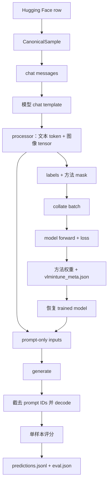

# vlmintune 是什么？

`vlmintune` 是一个面向视觉语言模型（VLM）的 instruction tuning library。它将数据集、模型、训练方法和评估方法连接为一套完整的训练与评估 pipeline，覆盖从数据加载、模型训练到 checkpoint 评估的全过程。

统一的组件接口让不同实验共享相同的数据处理、训练、保存和评估逻辑。使用者可以按需替换其中任意组件，从而减少重复代码和手工配置，更方便地复用实验流程，并在一致的环境中比较不同模型与方法。

### 1. 工作方式

数据进入 pipeline 后，依次经过所选模型、训练方法和训练流程。训练结果保存为 checkpoint，需要评估时再加载 checkpoint 并运行指定的评估方法。

<div class="package-diagram" role="img" aria-label="数据输入依次经过模型、训练方法和训练流程生成 checkpoint；评估时加载 checkpoint，运行评估方法并输出预测和指标">
  <div class="diagram-lane">
    <div class="diagram-lane-heading"><strong>训练</strong><span>选择组件并执行训练</span></div>
    <div class="diagram-flow">
      <div class="diagram-node"><span class="diagram-node-label">Input</span><strong>Dataset</strong><small>加载训练数据</small></div>
      <span class="diagram-flow-arrow" aria-hidden="true">→</span>
      <div class="diagram-node"><span class="diagram-node-label">Select</span><strong>Model</strong><small>选择视觉语言模型</small></div>
      <span class="diagram-flow-arrow" aria-hidden="true">→</span>
      <div class="diagram-node"><span class="diagram-node-label">Apply</span><strong>Method</strong><small>应用训练方法</small></div>
      <span class="diagram-flow-arrow" aria-hidden="true">→</span>
      <div class="diagram-node"><span class="diagram-node-label">Run</span><strong>Training</strong><small>执行统一训练流程</small></div>
    </div>
  </div>
  <div class="diagram-bridge">
    <span class="diagram-bridge-arrow" aria-hidden="true">↓</span>
    <div class="diagram-checkpoint"><span class="diagram-node-label">Training output</span><strong>Checkpoint</strong><small>保存训练权重与恢复信息</small></div>
    <span class="diagram-bridge-note">可选：加载并评估</span>
    <span class="diagram-bridge-arrow" aria-hidden="true">↓</span>
  </div>
  <div class="diagram-lane diagram-lane-eval">
    <div class="diagram-lane-heading"><strong>评估</strong><span>从 checkpoint 生成结果</span></div>
    <div class="diagram-flow diagram-flow-eval">
      <div class="diagram-node"><span class="diagram-node-label">Restore</span><strong>Load</strong><small>恢复模型与训练方法</small></div>
      <span class="diagram-flow-arrow" aria-hidden="true">→</span>
      <div class="diagram-node"><span class="diagram-node-label">Evaluate</span><strong>Evaluation method</strong><small>运行所选评估方法</small></div>
      <span class="diagram-flow-arrow" aria-hidden="true">→</span>
      <div class="diagram-node"><span class="diagram-node-label">Output</span><strong>Results</strong><small>输出预测结果与指标</small></div>
    </div>
  </div>
</div>

### 2. 核心功能

<dl class="feature-list">
  <dt>Dataset</dt>
  <dd>在不同的内置数据集之间选择，或通过 dataset API 接入新的数据来源。</dd>
  <dt>Model</dt>
  <dd>加载不同的已注册视觉语言模型，或通过 model API 接入新的 Hugging Face 模型。</dd>
  <dt>Training method</dt>
  <dd>切换不同的内置训练方法，或通过 method API 实现并注册新的方法。</dd>
  <dt>Evaluation method</dt>
  <dd>选择不同的内置评估方法，或通过 evaluation API 添加新的评估逻辑与指标。</dd>
</dl>

## 快速开始

使用本教程开始使用 `vlmintune`。你将安装 library，使用 LoRA 在 8 个 TextVQA 样本上完成一次最小训练，然后重新加载生成的 checkpoint 并运行 evaluation。

### 概览

本教程使用内置的 `qwen25vl_3b_instruct` 模型、`lmms-lab/textvqa` 数据集和 `lora` 方法。所有命令均在仓库根目录执行。

<div class="prerequisite-note">
  <strong>开始前</strong>
  <p>需要 Python 3.10 或更高版本，以及支持 BF16 且具有足够显存的 CUDA GPU。首次运行还需要下载 Qwen2.5-VL 3B 模型和 TextVQA 数据。</p>
</div>

本教程包含以下任务：

1. [Step 1：安装](#22-step-1安装)
2. [Step 2：创建训练配置](#23-step-2创建训练配置)
3. [Step 3：运行训练](#24-step-3运行训练)
4. [Step 4：评估 checkpoint](#25-step-4评估-checkpoint)

### 1. 安装

从 [anonymous repository]() 下载源码，进入项目目录并安装：

```bash
cd vlmintune
pip install -e .
```

本教程使用 LoRA，不需要额外安装 bitsandbytes。

### 2. 创建训练配置

在仓库根目录创建 `train_config.yaml`：

```yaml
model: qwen25vl_3b_instruct
dataset: lmms-lab/textvqa
method: lora
batch_size: 1
max_samples: 8
output_dir: experiments/textvqa_lora_demo/checkpoint
```

未写出的字段使用默认值：训练 1 个 epoch、learning rate 为 `2e-4`、gradient accumulation 为 `4`、最大序列长度为 `2048`。

### 3. 运行训练

运行训练 CLI：

```bash
python -m vlmintune.training --config train_config.yaml
```

训练完成后，checkpoint 位于 `experiments/textvqa_lora_demo/checkpoint`。其中的 `vlmintune_meta.json` 记录模型和训练方法，其他文件保存 LoRA 权重。

### 4. 评估 checkpoint

在仓库根目录创建最小的 `eval_config.yaml`：

```yaml
experiment:
  name: textvqa_lora_demo

eval:
  source: trained
  dataset_name: lmms-lab/textvqa
  max_samples: 8
```

运行 evaluation CLI：

```bash
python -m vlmintune.eval --config eval_config.yaml
```

Evaluation 会从约定路径自动找到 checkpoint，并从 `vlmintune_meta.json` 恢复模型与 LoRA 方法。运行完成后可以查看：

```text
experiments/textvqa_lora_demo/eval_trained/
├── eval.json
├── predictions.jsonl
├── eval_ids.json
└── run.log
```

`eval.json` 包含汇总指标，`predictions.jsonl` 保存每个样本的预测、ground truth 和单样本分数。

## 数据流



训练与评估共用 dataset adapter、模型 processor 和方法 registry。训练同时构造包含答案的完整对话和只包含问题的 prompt；评估只构造 prompt，并在生成后解码新增 token。

| 阶段 | 主要入口 | 输出 |
| --- | --- | --- |
| 加载与标准化 | `HFDatasetsAdapter`、`HFDatasetSpec.parse_row()` | `CanonicalSample` |
| 构造对话 | `build_prompt_messages()`、`build_full_messages()` | prompt-only 和 full message list |
| 渲染模板 | `processor.apply_chat_template()` | `prompt_text` 和 `full_text` |
| 多模态处理 | `processor(text=..., images=...)` | `input_ids`、视觉 tensor 与模型相关字段 |
| 建立监督 | `ChatTemplatePreprocessor.tokenize()` | `labels` 及可选的 L2T、MoReS、ReFT mask |
| 组成 batch | `ChatTemplatePreprocessor.collate()` | 右侧补齐的 tensor batch 与 `attention_mask` |
| 训练 | `TrainingMethod`、`model(**forward_batch)` | logits、loss、gradient 与更新后的方法参数 |
| 保存 | `TrainingMethod.save_checkpoint()` | 方法权重与 `vlmintune_meta.json` |
| 评估 | `LocalMethod.generate()`、`score_prediction()` | prediction、单样本分数与汇总指标 |

### 1. 数据集

| 配置中的 `dataset` | 实际 Hugging Face 数据集 | 默认训练 split | 默认评估 split | 指标 |
| --- | --- | --- | --- | --- |
| `lmms-lab/textvqa` | `lmms-lab/textvqa` | `train` | `validation` | `vqa_accuracy` |
| `pingzhili/vqa_v2` | `pingzhili/vqa_v2` | `train` | `validation` | `vqa_accuracy` |
| `ebrukilic/vizwiz_vqa_dataset` | `ebrukilic/vizwiz_vqa_dataset` | `train` | `validation` | `vqa_accuracy` |
| `Mineru/GQA` | `Mineru/GQA` | `train_balanced` | `val_balanced` | `normalized_exact_match` |
| `scienceqa_image` | `derek-thomas/ScienceQA` 中带图样本 | `train` | `validation` | `normalized_exact_match` |

设置正数 `max_samples` 时，adapter 自动使用 streaming。公共训练会把训练 `seed` 作为 `sample_seed` 传入，所以先 shuffle，再截取目标数量；直接使用 Python data API 时需要显式传入 `sample_seed` 才会 shuffle。完整训练通常使用 map-style dataset。

直接从 Python 读取统一样本：

```python
from vlmintune import HFDatasetsAdapter

adapter = HFDatasetsAdapter(
    dataset_name="lmms-lab/textvqa",
    usage="train",
    max_samples=100,
    sample_seed=42,
)

for sample in adapter:
    print(sample.id, sample.question, sample.train_answer)
```

### 2. 样本如何进入模型

下面使用一个简化的 TextVQA 样本贯穿整个预处理过程。示例值用于说明数据结构，不对应数据集中的特定样本。

#### 1. Hugging Face row

```python
row = {
    "question_id": "demo-1",
    "image": pil_image,  # PIL.Image.Image
    "question": "What word is written on the sign?",
    "answers": [
        {"answer": "stop"},
        {"answer": "stop"},
        {"answer": "STOP"},
        {"answer": "stop"},
    ],
}
```

#### 2. `CanonicalSample`

`TextVQASpec.parse_row()` 根据列映射读取 row。训练答案使用原始答案字符串的多数票，评估答案保留全部标注；PIL 图像暂存在 metadata 中：

```python
CanonicalSample(
    id="demo-1",
    image_path="<in_memory>",
    question="What word is written on the sign?",
    train_answer="stop",
    eval_answers=["stop", "stop", "STOP", "stop"],
    metadata={"_pil_image": pil_image},
)
```

图像也可以来自文件路径或 Hugging Face 的 bytes/path 字段；`load_sample_image()` 会在送入 processor 前把它统一转换为 RGB。

#### 3. Chat messages

训练会从同一个样本构造两份对话。`full_messages` 包含答案，`prompt_messages` 只包含用户问题：

```python
prompt_messages = [
    {
        "role": "user",
        "content": [
            {"type": "image"},
            {"type": "text", "text": "What word is written on the sign?"},
        ],
    }
]

full_messages = [
    *prompt_messages,
    {
        "role": "assistant",
        "content": [{"type": "text", "text": "stop"}],
    },
]
```

#### 4. 应用 chat template 后

`apply_chat_template()` 把结构化 messages 转成模型自己的对话字符串。`full_messages` 使用 `add_generation_prompt=False`，`prompt_messages` 使用 `add_generation_prompt=True`。同一份消息在两个内置模型上会得到不同结果。

**Qwen2.5-VL**

```text
# prompt_text
<|im_start|>system
You are a helpful assistant.<|im_end|>
<|im_start|>user
<|vision_start|><|image_pad|><|vision_end|>What word is written on the sign?<|im_end|>
<|im_start|>assistant

# full_text
<|im_start|>system
You are a helpful assistant.<|im_end|>
<|im_start|>user
<|vision_start|><|image_pad|><|vision_end|>What word is written on the sign?<|im_end|>
<|im_start|>assistant
stop<|im_end|>
```

**LLaVA 1.5**

```text
# prompt_text
USER: <image>
What word is written on the sign? ASSISTANT:

# full_text
USER: <image>
What word is written on the sign? ASSISTANT: stop </s>
```

这一步仍然只是字符串渲染：Qwen 中只有一个 `<|image_pad|>`，LLaVA 中只有一个 `<image>`。下一步 processor 才会根据图像分辨率和 patch 设置把该占位符展开为模型实际需要的多个 image token。特殊 token、空白和结束符来自所选 Hugging Face processor，Library 不硬编码模板文本。

#### 5. Processor 输出

`full_text` 和 `prompt_text` 会带着同一张 RGB 图像分别进入 processor：

```python
full_inputs = processor(
    text=full_text,
    images=[image],
    return_tensors="pt",
    truncation=True,
    max_length=max_length,
)

prompt_inputs = processor(
    text=prompt_text,
    images=[image],
    return_tensors="pt",
    truncation=True,
    max_length=max_length,
)
```

Processor 同时完成文本 tokenization、图像预处理和 image-token 展开。共同字段包括 `input_ids` 和 `attention_mask`；有图像时还会包含 `pixel_values`。具体 shape 由 processor、图像尺寸和模型配置决定。

| 模型 | 典型 processor 输出 | 图像占位符的变化 |
| --- | --- | --- |
| Qwen2.5-VL | `input_ids`、`attention_mask`、`mm_token_type_ids`、`pixel_values`、`image_grid_thw` | `<|image_pad|>` 按视觉网格展开 |
| LLaVA 1.5 | `input_ids`、`attention_mask`、`pixel_values` | `<image>` 按图像 patch 数展开 |

因此 token 序列可以概括为：

```text
[system/chat tokens | image-start | image token × N | image-end |
 question tokens | assistant-start | answer tokens | end token]
```

#### 6. Labels 与方法 mask

答案边界来自两次 processor 调用产生的 token 长度：

```python
input_ids = full_inputs["input_ids"][0]
prompt_len = min(prompt_inputs["input_ids"].shape[1], input_ids.shape[0])

labels = input_ids.clone()
labels[:prompt_len] = -100

# 概念上：
# input_ids = [ prompt tokens | answer tokens ]
# labels    = [ -100 ... -100 | answer token ids ]
```

`-100` 表示该位置不参与 causal language-model loss。普通 LoRA、QLoRA、DoRA 和 VL-Adapter 只监督 answer token；L2T 会额外把 `CanonicalSample.question` 的完整文本 token 写回 labels，但仍排除 system、图片占位符和 chat role/control token。L2T、MoReS 和 ReFT 都通过统一的 `method_mask` 传递逐 token 选择结果：L2T 用它扩展监督位置，MoReS 和 ReFT 用它控制 layer hook。

### 3. 模型

| 配置名 | Hugging Face model ID |
| --- | --- |
| `qwen25vl_3b_instruct` | `Qwen/Qwen2.5-VL-3B-Instruct` |
| `llava15_7b` | `llava-hf/llava-1.5-7b-hf` |

你也可以根据需要添加新的模型，具体方法见[扩展开发中的“2. 模型”](#42-模型)。

### 4. 训练方法

| `method` | 固定 recipe | 模型支持 | 对应论文 |
| --- | --- | --- | --- |
| `lora` | rank 8、alpha 16、dropout 0.05；适配所有语言层的 q/k/v/o 与 gate/up/down projection | Qwen、LLaVA | [LoRA: Low-Rank Adaptation of Large Language Models](https://openreview.net/forum?id=nZeVKeeFYf9) |
| `qlora` | rank 64、alpha 16、dropout 0；NF4 4-bit、double quant、BF16 compute、PagedAdamW8bit | Qwen、LLaVA | [QLoRA: Efficient Finetuning of Quantized LLMs](https://proceedings.neurips.cc/paper_files/paper/2023/hash/1feb87871436031bdc0f2beaa62a049b-Abstract-Conference.html) |
| `dora` | LoRA 固定结构加 DoRA weight decomposition | Qwen、LLaVA | [DoRA: Weight-Decomposed Low-Rank Adaptation](https://proceedings.mlr.press/v235/liu24bn.html) |
| `reft` | tied LoReFT，rank 4；所有语言层的 prompt 前 4、后 4 个位置 | Qwen、LLaVA | [ReFT: Representation Finetuning for Language Models](https://proceedings.neurips.cc/paper_files/paper/2024/hash/75008a0fba53bf13b0bb3b7bff986e0e-Abstract-Conference.html) |
| `mores` | rank 1；所有语言层中前 4、后 5 个视觉 token | Qwen、LLaVA | [LLaVA Steering: Visual Instruction Tuning with 500x Fewer Parameters through Modality Linear Representation-Steering](https://aclanthology.org/2025.acl-long.739/) |
| `vl_adapter` | attention/FFN 各一个 bottleneck adapter，reduction factor 8；同时训练 LayerNorm 与 visual merger | 仅 Qwen | [VL-Adapter: Parameter-Efficient Transfer Learning for Vision-and-Language Tasks](https://openaccess.thecvf.com/content/CVPR2022/html/Sung_VL-Adapter_Parameter-Efficient_Transfer_Learning_for_Vision-and-Language_Tasks_CVPR_2022_paper.html) |
| `l2t` | full-SFT；训练语言模型、LM head 和视觉投影，冻结视觉编码器；监督完整 user prompt 文本与 answer | Qwen、LLaVA | [Learning to Instruct for Visual Instruction Tuning](https://proceedings.neurips.cc/paper_files/paper/2025/hash/43c18853329c7504996b255252b6cb1f-Abstract-Conference.html) |

### 5. Batch、forward 与 loss

#### 1. 组成 batch

Tokenization 是 lazy 的；DataLoader 取到样本后才执行上述处理。失败的样本会被记录并过滤，剩余样本由 `collate()` 在序列右侧补齐：

```python
batch = {
    "input_ids": LongTensor[batch_size, max_seq_len],
    "labels": LongTensor[batch_size, max_seq_len],
    "attention_mask": LongTensor[batch_size, max_seq_len],
    "pixel_values": Tensor[...],
    # 模型或方法需要时还会包含：
    "image_grid_thw": LongTensor[..., 3],
    "mm_token_type_ids": LongTensor[batch_size, max_seq_len],
    "method_mask": BoolTensor[batch_size, max_seq_len],
}
```

`input_ids` 的右侧补齐值为 0，`labels` 的补齐值为 `-100`，`attention_mask` 对真实 token 标 1、对补齐位置标 0。`pixel_values` 和 `image_grid_thw` 都沿第一维 concatenate。

#### 2. 进入模型并计算 loss

```python
batch = to_device(batch, device)
batch["labels"] = method.preprocess_labels(
    batch["input_ids"],
    batch["labels"],
    batch_meta=batch,
)
forward_batch = method.build_forward_batch(batch)
outputs = model(**forward_batch)
loss, metrics = method.compute_loss(model, batch, outputs)
loss.backward()
```

`build_forward_batch()` 会移除模型本身不接受的方法 metadata。MoReS 和 ReFT 会先保存各自的 intervention mask，再由注册在语言层上的 hook 修改选中位置的 hidden states。Loss 优先使用模型返回的 `outputs.loss`；否则对 logits 和 labels 做一位 causal shift，并以 `-100` 作为 ignore index。达到 gradient accumulation 数量后，Trainer 才执行 gradient clipping、optimizer step 和 scheduler step。

模型内部先把文本 token 映射为 embedding，同时由 vision encoder 提取图像特征并投影到语言模型的 hidden size；投影后的视觉向量按 image-token 位置写回序列。Language model 随后输出 `logits[batch, sequence, vocabulary]`，有 labels 时再得到 scalar loss。Qwen 使用 `image_grid_thw` 与多模态 RoPE 对齐视觉网格，LLaVA 则把 CLIP patch features 经过 multimodal projector 后与 `<image>` token 一一对应。

### 6. Checkpoint 保存与恢复

公共保存与恢复流程由 `TrainingMethod` 基类统一实现：

```text
save_checkpoint(model, path, metadata)
├── _save_weights(model, path)             # 方法实现
└── vlmintune_meta.json                     # 基类统一写入

load_for_inference(path, model_name)
├── 从 ModelSpec 重新加载 processor 和 base model
├── 按 requires_quantization() 决定是否 4-bit
├── _restore_model(...)                     # 方法实现
└── model.eval()
```

checkpoint 不保存一份可独立加载的完整 base model 或 processor；恢复时仍会根据 model spec 从 Hugging Face 加载基础组件。它也不包含 optimizer、scheduler、随机数和 dataloader 状态，因此用于 inference/evaluation restore，不是精确续训。`vlmintune_meta.json` 至少让 evaluator 知道：

```json
{
  "model_name": "qwen25vl_3b_instruct",
  "hf_model_id": "Qwen/Qwen2.5-VL-3B-Instruct",
  "ft_method": "mores",
  "recipe": "mores",
  "final_loss": 1.234567
}
```

方法权重布局：

| 方法组 | 主要权重文件 |
| --- | --- |
| `lora`、`qlora`、`dora` | PEFT `adapter_config.json`、`adapter_model.safetensors` |
| `l2t` | `l2t_tuned.pt` |
| `vl_adapter` | `vl_adapter_tuned.pt` |
| `mores` | `mores_tuned.pt` |
| `reft` | `reft_tuned.pt` |
| `mores_lora`、`mores_dora` | PEFT adapter 文件 + `mores_tuned.pt` |
| `reft_lora` | PEFT adapter 文件 + `reft_tuned.pt` |

每个目录还包含统一的 `vlmintune_meta.json`。普通 LoRA/DoRA 推理恢复后会 merge adapter；QLoRA 保留量化 PEFT model；联合方法恢复两个结构组件。

### 7. Evaluation

Evaluation 包含两个彼此独立的选择：从哪里加载模型，以及使用什么 metric 评分。`source=base` 直接加载 model spec；`source=trained` 从 `vlmintune_meta.json` 取得模型名和方法名，再恢复方法权重。

#### 1. Prompt-only generation

评估样本不包含 `train_answer`。它只经过 prompt messages、`add_generation_prompt=True` 的 chat template 和 multimodal processor，然后执行确定性的 greedy generation：

```python
prepared = processor(text=prompt_text, images=[image], return_tensors="pt")
prepared = method.prepare_inference_inputs(model, processor, prepared)

output_ids = model.generate(
    **prepared,
    max_new_tokens=max_new_tokens,
    do_sample=False,
)
prompt_len = prepared["input_ids"].shape[1]
prediction = processor.decode(
    output_ids[0][prompt_len:],
    skip_special_tokens=True,
).strip()
```

MoReS 和 ReFT 会在 generation 的第一次 forward 自动重建 inference intervention mask；后续 KV-cache step 不再重复干预 prompt。当前 evaluation 始终使用 `do_sample=False`，因此配置中的 temperature 不改变生成结果。

#### 2. Prediction 与评分

每个样本会立即写入一行 `predictions.jsonl`：

```json
{
  "id": "demo-1",
  "question": "What word is written on the sign?",
  "prediction": "stop",
  "ground_truth": ["stop", "stop", "STOP", "stop"],
  "scores": {"vqa_accuracy": 1.0}
}
```

Dataset spec 的 `metric_family` 决定 `score_prediction()` 调用哪种指标。循环结束后，单样本分数取平均并乘以 100，连同 generation diagnostics 写入 `eval.json`；被评估的样本 ID 与采样参数写入 `eval_ids.json`。

| 类型 | 名称 | 行为 |
| --- | --- | --- |
| source | `base` | 直接加载 model spec 指向的 Hugging Face base model |
| source | `trained` | 读取 `vlmintune_meta.json`，恢复 checkpoint 对应的训练方法与权重 |
| metric | `vqa_accuracy` | 对多标注答案做 VQA leave-one-out 评分；TextVQA、VQAv2、VizWiz 使用 |
| metric | `normalized_exact_match` | 规范化后与任一 ground truth 完全相同即得 1；GQA、image-only ScienceQA 使用 |

Metric 由 dataset spec 的 `metric_family` 自动选择，evaluation YAML 没有 `eval.metric`。规范化会处理大小写、标点、冠词、英文 0 到 10 的数字和常见缩写。`predictions.jsonl` 中单条分数范围为 0 到 1；`eval.json` 中汇总分数乘以 100，并保留两位小数。

可以从 Python 查看当前 registry：

```python
from vlmintune.models import list_model_names
from vlmintune.data.datasets import DATASET_SPECS
from vlmintune.training.methods.registry import list_training_methods

print(list_model_names())
print(sorted(DATASET_SPECS))
print(list_training_methods())
```

## 扩展开发

扩展一个组件只做两件事：实现最小接口，然后加入对应的 registry。

### 1. 数据集

#### 1. Hugging Face 数据集

普通 Hugging Face VQA 数据集不需要新增 function。`HFDatasetSpec` 已经实现了 row 解析，只需声明 dataset 信息和列映射。

例如，一个包含 `sample_id`、`image`、`prompt` 和 `answers` 四列的数据集：

```python
from vlmintune.data.datasets.base import (
    ColumnMapping,
    DatasetDataModel,
    HFDatasetSpec,
)


class MyVQASpec(HFDatasetSpec):
    dataset_name = "owner/my-vqa"
    data_model = DatasetDataModel(dataset_name=dataset_name)
    mapping = ColumnMapping(
        id_col="sample_id",
        image_col="image",
        question_col="prompt",
        answer_col="answers",
    )
```

在 `src/vlmintune/data/datasets/registry.py` 中导入它，并加入 `_SPEC_CLASSES`：

```python
from vlmintune.data.datasets.my_vqa import MyVQASpec

_SPEC_CLASSES = (
    # existing dataset specs
    MyVQASpec,
)
```

只有 question 或 answer 不是普通字符串或字符串列表时，才需要覆盖 `parse_question(row)` 或 `parse_answers(row)`。

#### 2. 自有数据集

### 2. 模型

一个 `ModelSpec` 只需要实现三个 function：

```python
def get_transformer_layers(self, model): ...
def get_hidden_size(self, model): ...
def get_image_token_id(self, model): ...
```

例如，Qwen 风格的 Hugging Face VLM：

```python
from vlmintune.models.base import ModelSpec


class MyModelSpec(ModelSpec):
    name = "my_model"
    hf_model_id = "owner/my-vlm"

    def get_transformer_layers(self, model):
        return model.model.language_model.layers

    def get_hidden_size(self, model):
        return model.config.text_config.hidden_size

    def get_image_token_id(self, model):
        return model.config.image_token_id


MY_MODEL_SPEC = MyModelSpec()
```

然后在 `src/vlmintune/models/registry.py` 中加入：

```python
from vlmintune.models.my_model import MY_MODEL_SPEC


_MODEL_SPECS = {
    # existing model specs
    MY_MODEL_SPEC.name: MY_MODEL_SPEC,
}
```

三个属性路径要按目标模型的真实结构填写；该模型需要能被 Transformers 的 `AutoProcessor` 和 image-to-text AutoModel 加载。

### 3. 训练方法

一个 `TrainingMethod` 必须实现五个 function：

```python
class MyMethod(TrainingMethod):
    def prepare_model_impl(self, model, processor, model_spec): ...
    def compute_loss(self, model, batch, outputs): ...
    def get_trainable_params(self, model): ...
    def _save_weights(self, model, path): ...
    def _restore_model(self, model, processor, model_spec, path): ...
```

`save_checkpoint()` 和 `load_for_inference()` 已由基类实现，子类不需要重写。

#### 1. `vl_adapter` 示例

`vl_adapter` 的 adapter block 是 `x + Up(GELU(Down(x)))`。block 和 forward hook 都是普通 PyTorch 代码；下面只展示它如何实现 `TrainingMethod` 的五个接口。

```python
class VLAdapterMethod(TrainingMethod):
    name = "vl_adapter"
    display_name = "Single Adapter (VL-Adapter style)"
    supported_model_names = ("qwen25vl_3b_instruct",)

    def prepare_model_impl(self, model, _processor, model_spec):
        model.requires_grad_(False)
        layers = list(model_spec.get_transformer_layers(model))
        hidden_size = model_spec.get_hidden_size(model)

        adapter_layers = []
        for layer in layers:
            reference = next(layer.parameters())
            adapter_layers.append(
                VLAdapterLayer(hidden_size).to(
                    device=reference.device,
                    dtype=reference.dtype,
                )
            )

        model.vl_adapter_layers = nn.ModuleList(adapter_layers)
        for layer, adapters in zip(layers, model.vl_adapter_layers):
            layer.self_attn.register_forward_hook(
                self.attention_hook(adapters.attention)
            )
            layer.mlp.register_forward_hook(
                self.mlp_hook(adapters.mlp)
            )
            layer.input_layernorm.requires_grad_(True)
            layer.post_attention_layernorm.requires_grad_(True)

        model.model.language_model.norm.requires_grad_(True)
        model.model.visual.merger.requires_grad_(True)
        return model, "vl_adapter"

    def compute_loss(self, model, batch, outputs):
        return CROSS_ENTROPY_LOSS.compute(model, batch, outputs)

    def get_trainable_params(self, model):
        params = [p for p in model.parameters() if p.requires_grad]
        return [{"params": params}]

    def _save_weights(self, model, path):
        state_dict = {
            name: parameter.detach().cpu()
            for name, parameter in model.named_parameters()
            if parameter.requires_grad
        }
        torch.save(state_dict, os.path.join(path, "vl_adapter_tuned.pt"))

    def _restore_model(self, model, processor, model_spec, path):
        model, _ = self.prepare_model(
            model, processor, model_spec=model_spec
        )
        state_dict = torch.load(
            os.path.join(path, "vl_adapter_tuned.pt"),
            map_location="cpu",
            weights_only=True,
        )
        model.load_state_dict(state_dict, strict=False)
        return model
```

这五个 function 分别负责安装 adapter、计算 loss、返回 optimizer 参数、保存方法权重和恢复方法权重。最后在 `src/vlmintune/training/methods/registry.py` 中注册：

```python
from vlmintune.training.methods.vl_adapter import VLAdapterMethod

_TRAINING_METHODS = {
    # existing training methods
    "vl_adapter": VLAdapterMethod,
}
```

之后训练配置可以直接使用 `method: vl_adapter`。

### 4. 评估方法

当前 evaluation 的扩展单位是 metric。最基本的 function 接收 prediction 和 ground truths，返回 0 到 1 的分数：

```python
def answer_contains(prediction: str, ground_truths: list[str]) -> float:
    pred = normalize_answer(prediction)
    answers = [normalize_answer(answer) for answer in ground_truths]
    return float(any(answer and answer in pred for answer in answers))
```

在 `src/vlmintune/eval/vqa.py` 中接入三处：

```python
_SUPPORTED_METRICS = {
    "vqa_accuracy",
    "normalized_exact_match",
    "answer_contains",
}


def score_prediction(metric, prediction, ground_truth):
    ...
    if metric == "answer_contains":
        ground_truths = coerce_ground_truths(ground_truth)
        if not ground_truths:
            return {}
        score = answer_contains(prediction, ground_truths)
        return {"answer_contains": score}
```

最后让目标 dataset 使用这个 metric：

```python
data_model = DatasetDataModel(
    dataset_name="owner/my-vqa",
    metric_family="answer_contains",
)
```
